# Proposal
Please visit [Proposal](proposal.md).
# CheckPoint
Please visit [Check Point](checkpoint.md).

# Final Write Up

## Summary
We have implemented a distributed and parallel version of Latent Dirichlet Allocation (LDA) algorithm using OpenMPI library and OpenMP API. Our finalized version is 2x faster than [PLDA](https://code.google.com/archive/p/plda) when both lauching 64 processes, which is a parallel C++ implementation of LDA by Google. Our 64 processes implementation also achieves 20x speedup on its own, while 70x speedup against PLDA of a single process. Our test environment is in latedays cluster from 1 process to 64 processes, with at most 8 machines and 8 processes per machine. All of the experiments are run on two popular bag of words datasets [NIPS](https://archive.ics.uci.edu/ml/datasets/NIPS+Conference+Papers+1987-2015) and [NYTimes](https://archive.ics.uci.edu/ml/datasets/Bag+of+Words).

## Background

In natural language processing, LDA is a generative statistical model that extracts latent variables by observed variables. Specifically, LDA is a directed graphical model for topic discovery where each document is viewed as a topic distribution generated by Dirichlet prior. Then, each position can be assigned a topic by this document's topic distribution and word is generated according to the word distribution of assigned topic.

### Generative process
Documents are represented as random mixtures over latent topics, where each topic is characterized by a distribution over words. LDA assumes the following generative process for a corpus D consisting of M documents each of length Ni.

1. Choose a multinomial topic distribution &theta; for the document (according to a Dirichlet distribution Dir(&alpha;) over a fixed set of K topics)
2. Choose a multinomial term distribution &phi; for the topic (according to a Dirichlet distribution Dir(&beta;) over a fixed set of N terms)
3. For each word position
	* choose a topic Z according to multinomial topic distribution &theta;.
	* choose a word W according to multinomial term distribution &phi;.

### Implementation
The program receives a set of documents and a fixed topic number K as input. The output of LDA should be a topic-word table and document-topic table which represent the word distributions for all topics and topic distributions for all documents.

* Initialize topic distribution as uniform. Randomly assign each word in documents to one of the K topics.
* Calculate global distributions in topic-word and document-topic table.
* Iterate until convergence 
	* For each document and each word
		* Compute p(topic t \| document d, word w) = C * p(topic t \| document d) * p(word w \| topic t) according to global distributions for each topic.
		* Randomly assign one topic to current word according to above distribution.
		* Update global distributions.

The convergence is determined by the loglikelihood calclulated in each iteration of the corpus.

### Difficulty for parallelization
The key data structures are topic-word table and document-topic table. We can see that all the operations on these tables are +1 or -1 and in each iteration these tables will be modified. All the iterations are temporal related and can not be directly parallelized.

The most expensive parts of code are the calculation of topic distribution p(topic t \| document d, word w) and the sampling of topic according to this distribution. The sampling part is intrinsically sequential and can not be parallelized. The distribution calculation is too short to be parallelized unless there are millions of topics. This program is not restrictly data-parallel, but we can parallel on documents and loose some restrictions. The locality of the program is good because all the topic-related values are stored continuously and can be cached. However, when the corpus size or topic number is too large, the memory can not hold all the data structures.

## Approach
There are generally two scales to be considered when we want to gain a good speedup: topic number and corpus size. Our implementation tries to perform well when either scales up.

### sparseLDA

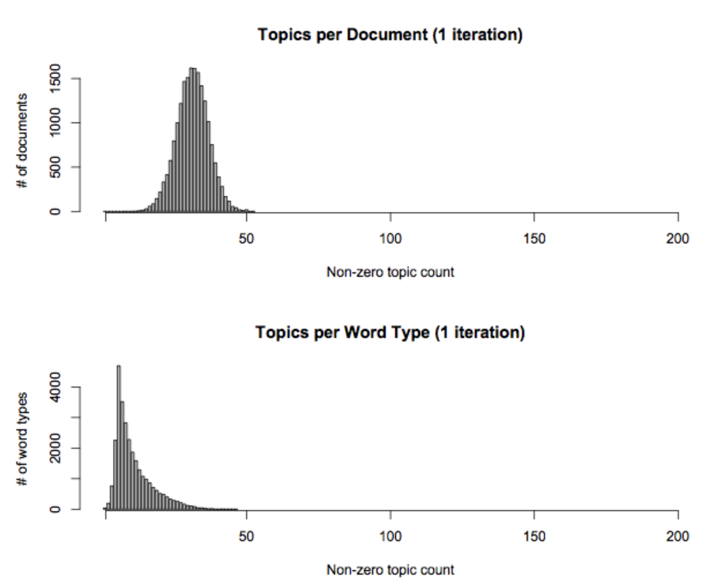

The above figure shows that both the topic-word table and document-topic table are very sparse. Thus, we can use hashmap to store the global tables if topic number is really large. Besides, we transform the calculation of the topic distribution into 3 subdivisions. They are called "topic-word" bin, "document-topic" bin and "smoothing only" bin respectively. Instead of sampling from original distribution, we sample from three bins now and we can expoit the sparsity to speedup the sampling. For the detailed implementation, please refer to [3].

### Distributed LDA

Since the Gibbs sampling part of the LDA algorithm is essentially sequential, we have to use modified algorithm that approximate the original algorithm in order to exploit parallelism. The basic LDA algorithm needs to iterate through the words of the whole corpus and update the distribution one by one. After tens or thousands of iterations, the distribution will converge and stop to change. To exploit parallelism, we need to use multiple workers. Each worker will be assigned with a sub-corpus and compute local distribution based on the sub-corpus. After each iteration, according to the different design, the workers will either communicate with each other or communicate with master nodes to update the global distribution. 

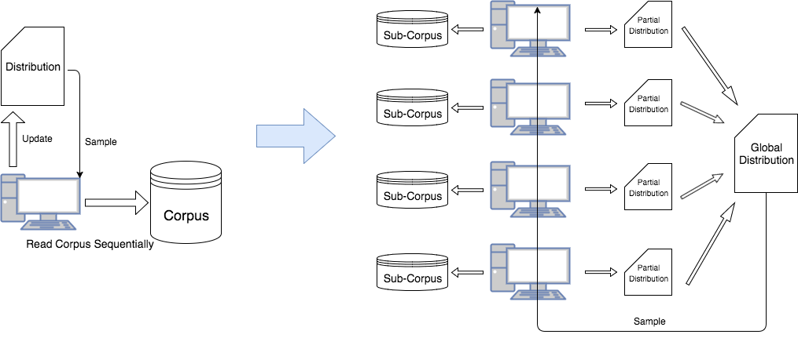

Noticing that this design's difference with original LDA algorithm. In this design, the global distribution will be updated by a 'batch' mode, rather than word by word. So convergence will differ from the original algorithm. If we have N worker nodes, these nodes will have 1/N workload each iteration comparing to original algorithm. So the running speed of each iteration will be much faster. But typically it needs more iterations to converge.

We implemented and compared two distribution model: synchronized and asynchronized model. We used MPI message passing interface to implement the communication between different processes.

**Synchronized model:**

Synchronized model is also known as Bulk Synchronous Parallel (BSP). The key idea is that all the worker nodes are equal. There will be a synchronization barrier after each iteration and workers can communicate with each other during this barrier. So the communication and computation parts have a clear boundary and the whole system's speed will be bounded by a slow worker. In our implementation, the global distribution consists of global topic word table and global topic table. These two global tables are simply equals to the sum of each local table. So we will call MPI\_Allreduce after each iteration to let worker get the latest global distribution. Since MPI is a symmetric execution model, this MPI\_Allreduce implies a synchronization barrier between iterations.

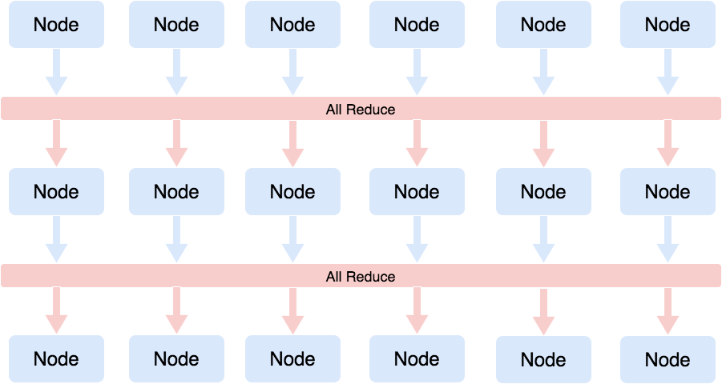

**Asynchronized model**

The asynchronized model needs one (or more) master nodes to manage the global distribution. Each worker will push its updates of distribution to the master and fetch the new global distribution after each iteration regardless other workers' schedule. So asynchronized algorithm's speed won't be hurt by very slow workers (but the convergece can still be hurt!). There exists two potential issues that may hurt the speed and the solution we find to fix:

1. The master node needs to merge the updates of different workers and make sure the distribution is consistent. So the master may become a bottleneck. Consider that update the model is basically add one large array to another, we can use OpenMP to accelarate it. We set the OpenMP block to 64 to prevent the false sharing problem.
2. Compare to the easy MPI\_Allreduce in synchronized model, the workers need to send update to server, wait server merge the update and then fetch the new global distribution. That is a more complex process and will take much more time than MPI\_Allreduce. Consider that in asynchronized model, we are not restricted to communicate after each iteration's computation. So we will do Gibbs sampling of iteration I, sending updates of iteration I - 1 and fetching new global distribution for iteration I + 1 in parallel to hide the long communication latency.

We expect that asynchronized model will have better per iteration speed than synchronized model on large dataset and large topic size since the communication time not negligible and can be hidden in asynchronized model. But the time to convergence is not that clear. The asynchronization makes it hard to record the change of likelihood and decide the stopping criteria. If we choose to stop the algorithm after a certain count of iterations, the asynchronized model will have even better superiority.

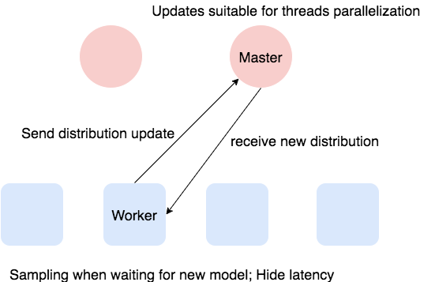

**Other consideration**

Although there are some open sourced parallel LDA implementations, we choose to build our system from scratch in order to understand all the details better. We will compare our implementation with the Google's PLDA because it is a C++ implemented, MPI based (which means the tools it used is very similar to ours) lightweight implementation. Some other implementations may be too heavyweighted (using large third party libraries), or use different techniques (Java, Hadoop).

## Results
We use NIPS and NYTimes datasets in our experiments. The basic information about the datasets is as follows:

|        | # Vocab           | # Doc  |
| ------------- |:-------------:| -----:|
| NIPS      | 11463 | 5811 |
| NYTimes   | 102660 |  299752 |

NIPS is relatively small while NYTimes is quite large. The different dataset size can help us to better measure the scalability of different implementation of LDA.

We run all experiments in the latedays cluster, each node has:

  * Two, six-core Xeon e5-2620 v3 processors (2.4 GHz, 15MB L3 cache, hyper-threading, AVX2 instruction support)
  * 16 GB RAM (60 GB/sec of BW)
  * MPI + OpenMP
 
We will run at most 8 nodes with 8 processes per node, which count to 64 processes. There are different running setting combinations we used:

| # Process |  # Topic |             LDA Implementation            |    Dataset    |
|:---------:|:--------:|:----------------------------------:|:-------------:|
|   1 ~ 64  | 16 ~ 256 | sync, async, plda, sync(no sparse) | NIPS, NYTimes |

From the combination setting above, we choose our sequential version with sparseLDA as the baseline for our synchronous and asynchronous lda. This baseline runs ~250s on NIPS and ~1200s on NYtimes. For PLDA, we choose PLDA with one process as the baseline. This baseline runs ~600s on NIPS and ~6500s on NYtimes. When we run the LDA for different number of processes, we set the number of topic to be 128 on NIPS and 64 on NYtimes.

We measured our performance on two different metrics: the average iteration time, the total running time. This is because we can run LDA for fixed number of iterations or until it is converged. The total running time measures the performance of running until convergence and the average iteration time measures the performance of running fixed number of iterations.

<table width="100%" border="0" cellpadding="0" bordercolor="white" bgcolor="white">

<!-- row 1 -->
<tr>
<td>

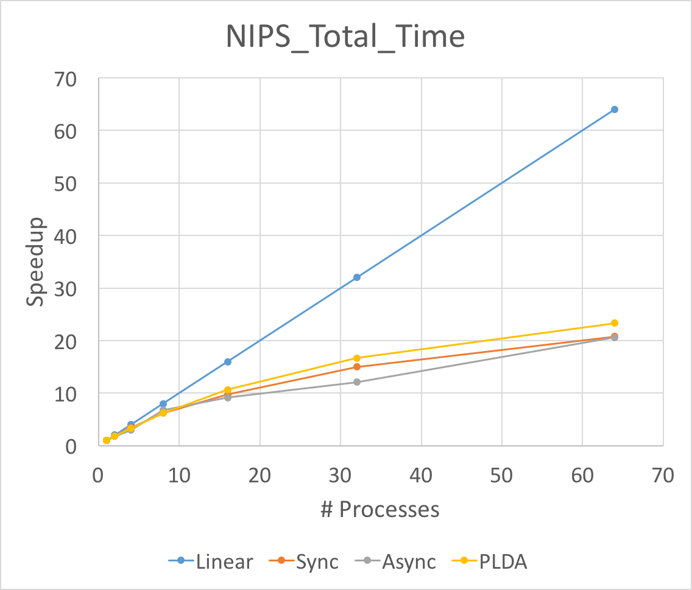

</td>
<td>

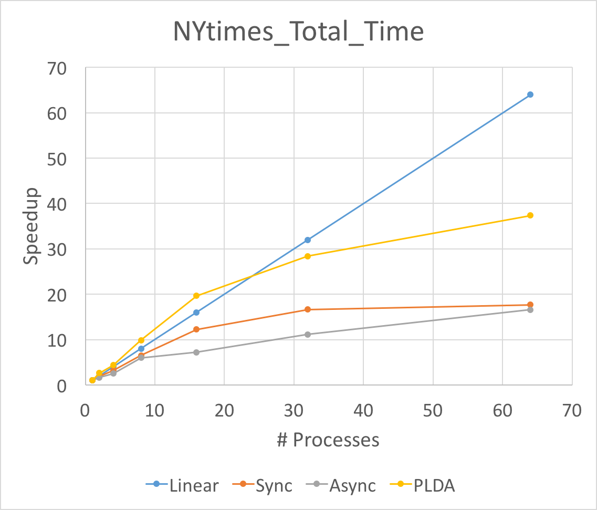

</td>
</tr>
<tr>
<td>

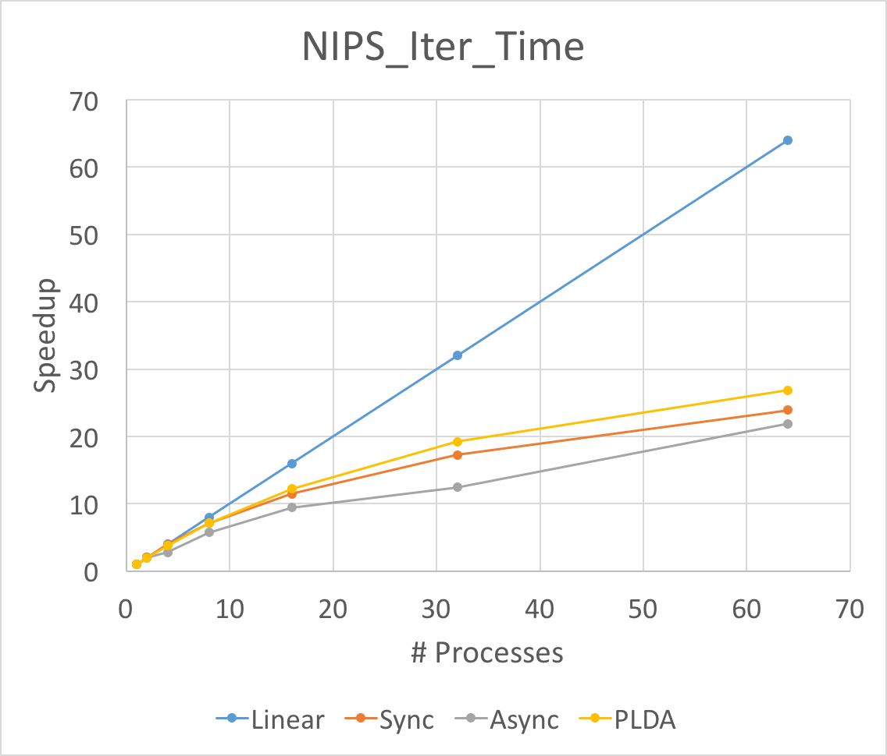

</td>
<td>

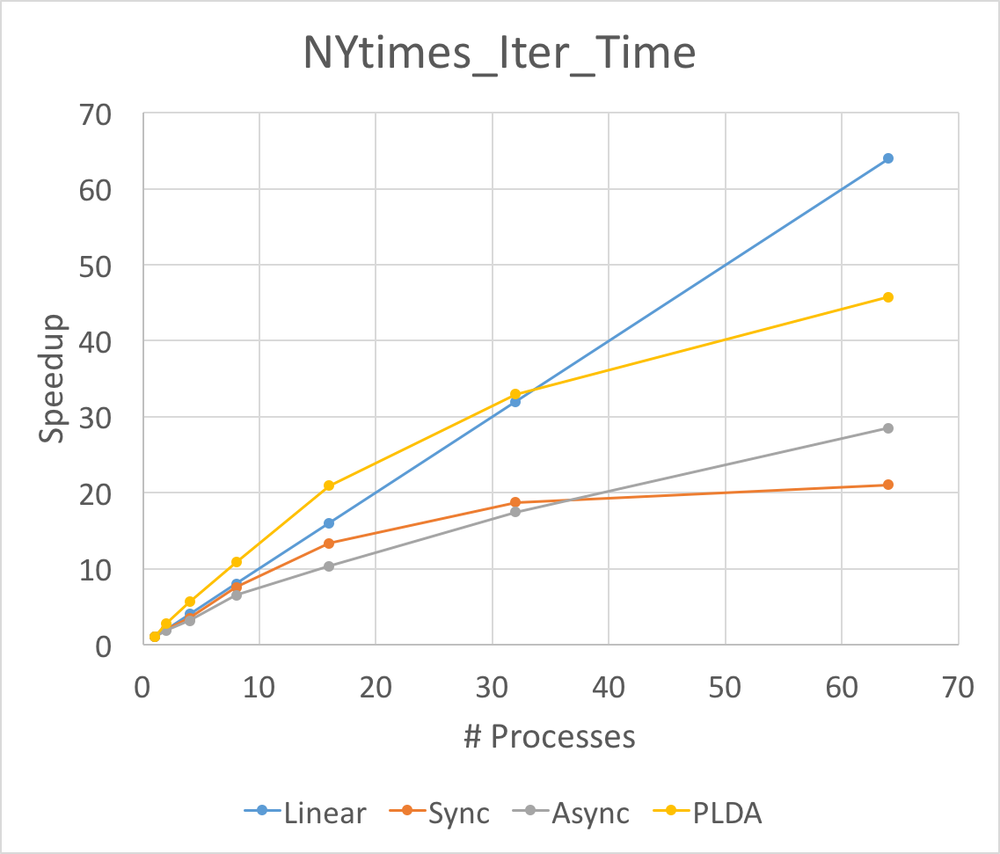

</td>
</tr>

</table>

The Figure above is the total running time and average iteration time speedup for three different implementation of LDA. We run experiments on NIPS and NYTimes respectively. As above mentioned, we set the number of topic to be 128 on NIPS and 64 on NYtimes. 

First of all, the speedup of average iteration time will always be larger than that of total running time. This is because the split of data will slow down the convergence speed. Although the running time for each iteration goes down fast, the total time for convergence will not go down so fast.

Secondly, noting that the asychronized implementation performances best in average iteration time speedup when launching 64 processes. This means the aynchronized implementation does help when the workload is large and unbalanced. Because our NIPS dataset is relatively small and the workloads are balanced, the asynchronized will be worse than synchronized. Besides, the asynchronized implementation will have larger communication cost, thus it will be better in large dataset. 

Thirdly, the super linearity occurred for PLDA in large dataset NYTimes. This might result from the inner implementation of PLDA. The split of the corpus help  one process to hold the data structures in caches or memories.

We can not reach the linear speedup for both synchronized and asynchronized implementation. The synchronized lda will have to Allreduce and communicate between each other. This communication cost slow down the entire program. We calculate the time for synchronized lda on communication and computation time and find that for 8 nodes, the computation time will be 10 times larger than MPI\_Allreduce time while for 64 nodes, the computation time will be 1/2 of the MPI\_Allreduce time. That makes only 1/3 of the total running time is doing computation thus the speedup will be smaller than 1/3 * 64 = 21x, which is consistent with our experiment results. As for asychronzied lda, the master node will have to sequentially reduce all the updates. which makes the client to wait for master even though some latency can be hidden. Another reason is that we cannot use more than 14 machines on latedays cluster and we have to run multiple processes on one machine if we want to run more thant 8 processes. Since we have multithread and OpenMP optimization in asynchronized implementation, one process will spawn a bunch of threads. Therefore, running multiple processes on the same machine may hurt the speedup.

<table width="100%" border="0" cellpadding="0" bordercolor="white" bgcolor="white">

<!-- row 1 -->

<tr>
<td>

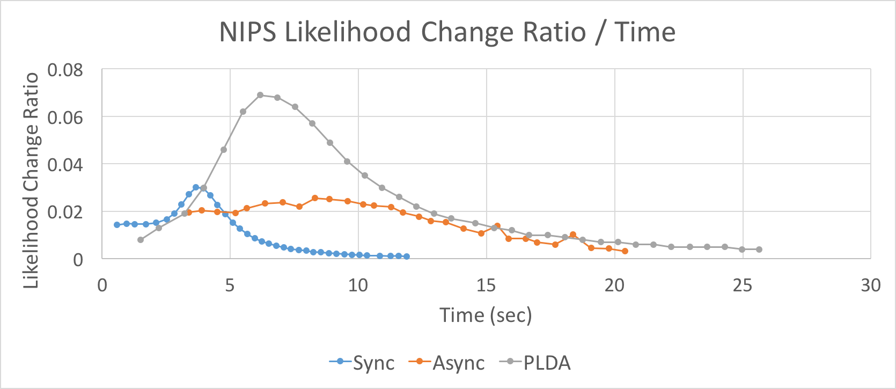

</td>
</tr>
<tr>
<td>

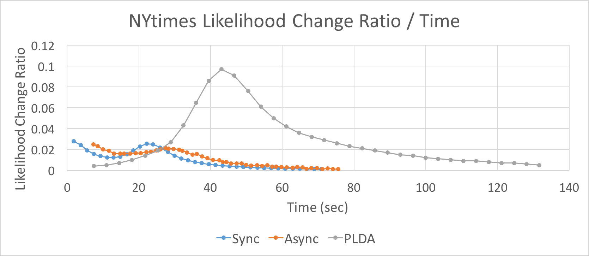

</td>
</tr>

</table>
The figure above is the logLikelihood change ratio over time for three different lda. We run experiments on NIPS and NYTimes respectively. As above mentioned, we set the number of topic to be 128 on NIPS and 64 on NYtimes. 

This figure shows that our implementation of both synchronized and asynchronized lda will converge faster and better than PLDA. 

The synchronized is much better than asynchronized lda in NIPS dataset while they are nearly the same in NYTime dataset. This supports the claim that asyncronized performs better in larger dataset. The reason might be that the communucation cost will become relatively small in large dataset for larger computation cost.

Noting that there will be a "burst" in all the graphs which means the lda finds the right distribution and quickly converges to it.

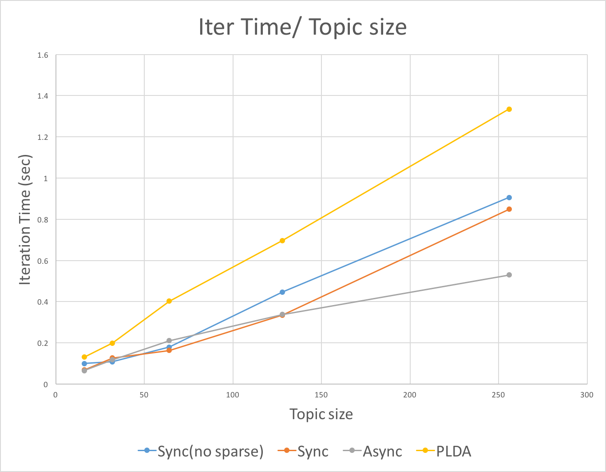

The above figure shows the average iteration time over topic size for four different lda. Both sync(no sparse) and PLDA do not provide sparseLDA. These two lda will increase faster in average iteration time over topic size compared with those with sparseLDA. sparseLDA do provides scalability in topic number.

Besides, the asynchronized lda performs best with the increasing of topic number. This is because the asynchronized lda will hide part of computaion cost in communication cost when computation increases.

## References
[1] Blei, David M., Andrew Y. Ng, and Michael I. Jordan. "Latent dirichlet allocation." Journal of machine Learning research 3.Jan (2003): 993-1022.

[2] Newman, David, et al. "Distributed algorithms for topic models." Journal of Machine Learning Research 10.Aug (2009): 1801-1828.

[3] Yao, Limin, David Mimno, and Andrew McCallum. "Efficient methods for topic model inference on streaming document collections." Proceedings of the 15th ACM SIGKDD international conference on Knowledge discovery and data mining. ACM, 2009.

[4] Li, Aaron Q., et al. "Reducing the sampling complexity of topic models." Proceedings of the 20th ACM SIGKDD international conference on Knowledge discovery and data mining. ACM, 2014.

[5] Yu, Hsiang-Fu, et al. "A scalable asynchronous distributed algorithm for topic modeling." Proceedings of the 24th International Conference on World Wide Web. ACM, 2015.

[6] Yuan, Jinhui, et al. "Lightlda: Big topic models on modest computer clusters." Proceedings of the 24th International Conference on World Wide Web. ACM, 2015.

[7] Ian Porteous, David Newman, Alexander Ihler, Arthur Asuncion, Padhraic Smyth and Max Welling. Fast Collapsed Gibbs Sampling For Latent Dirichlet Allocation. In KDD’ 2008.

[8] David Mimno. Efficient Inference for Multinomial Mixed Membership Models.

[9] Aaron Q. Li, Amr Ahmed, Sujith Ravi, and Alexander J. Smola. Reducing the sampling complexity of topic models. In KDD’ 2014.